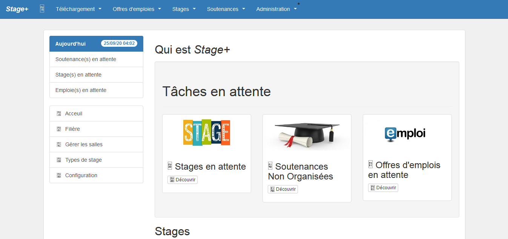

## Introduction

Internship + a web application dedicated to university institutions, allowing the various participants in an end-of-study internship to better manage the progress and evaluation of student internships.

## Informations

-   Status: under development
-   Latest version 1.0
-   Sector: education
-   Created: September 2020
-   Last updated: October 2020

## Table of contents
* [Documentation](#general-info)
* [Demo](#demo)
* [Screenshots](#screenshots)
* [Technologies](#technologies)
* [Setup](#setup)
* [Features](#features)
* [Status](#status)
* [Contact](#contact)
* [License](#license)

## Documentation
https://github.com/aniskchaou/STAGE--BACKOFFICE-ADMIN/wiki

## Demo
[enter link description here](https://pfe2015-stages-laravel.herokuapp.com/)

## Screenshots

## Technologies
* PHP
* Laravel

## Setup

## Features
-   Manage internships
-   Manage job offers
-   Manage students
-   Manage teachers

## Contact
contact@delta-dev-software.com

## License
<a href="license.txt">MIT License</a>